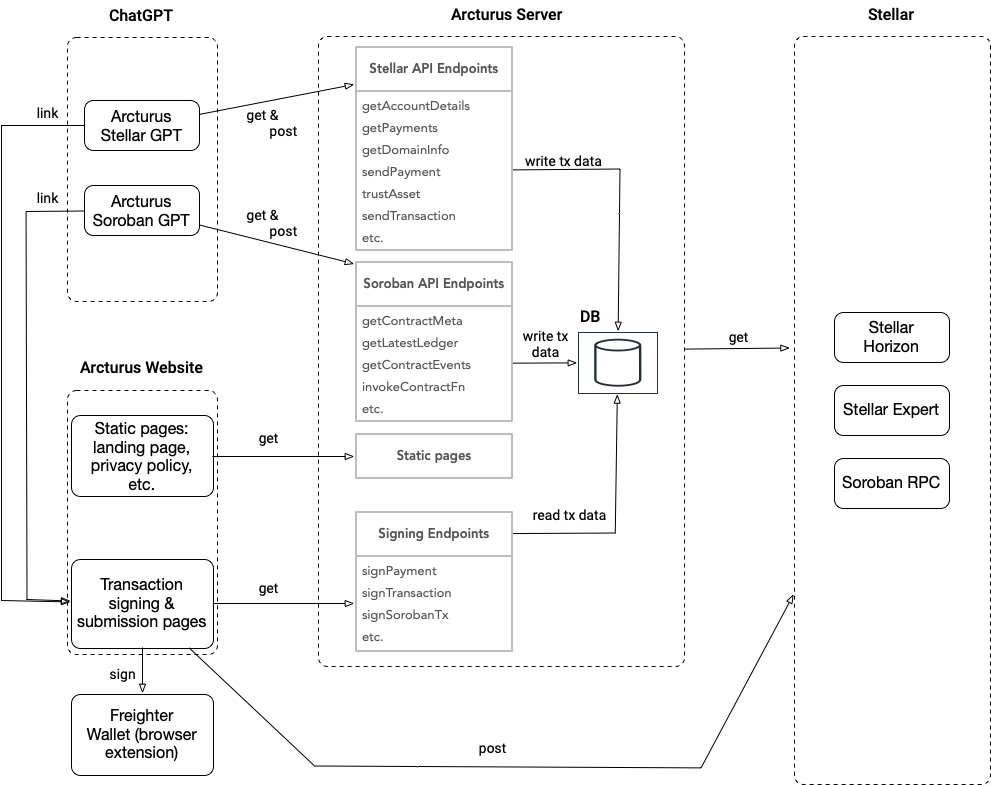

# Arcturus Architecture

## Overview

This section shows the components involved in the Arcturus project and how they interact with each other.

## Components

### GPTs

The `Arcturus Stellar GPT` and the `Arcturus Soroban GPT` live and run withing ChatGPT. They provide an OpenAPI specification for ChatGPT, so that ChatGPT can act as an intelligent API caller depending on the user's prompt.

### Arcturus Server

The Arcturus Server provides the API endpoints needed by the Arcturus GPTs, so that they can fetch the data they need and send transaction data to be signed later. 

If the user requests the signing and sending of a transaction via GPT, such as sending a stellar payment or invoking a soroban contract function, the Arcturus Server composes the needed transaction data first, stores it in its internal database and then returns a link to the user.
The user presses the link which leads her to the corresponding Arcturus signing page. Here the user can sign the transaction via the Freighter Wallet and send it to the Network.

## Website

The Arcturus Server serves static pages (e.g., the landing page) and the dynamic signing pages.

### Stellar Infrastructure

The Arcturus Server uses Stellar Infrastructure Tools such as Stellar Horizon, Stellar Expert, Soroban RPC Servers to fetch the real-time data needed by the GPTs to answer the user's prompts. 

Furthermore, the signing pages use this Infrastructure Tools to send the signed transactions to the Stellar Network.
